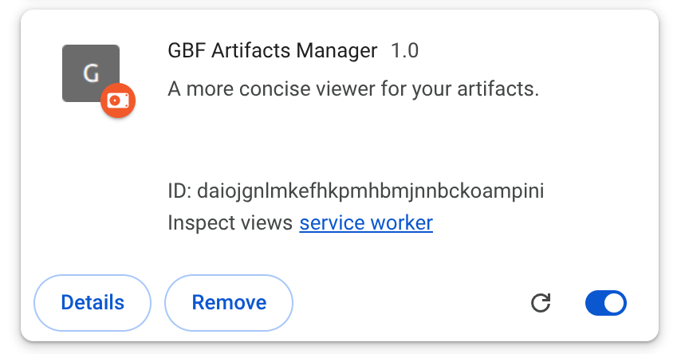

# Granblue Fantasy Artifacts Manager

A chrome extension to help manage your artifact inventory.

## Table of Contents

[Compatibility](#compatibility)  
[ToS Notes](#tos-notes)  
[Installation](#installation)  
[Features](#features)  
[Usage](#usage)  
[Troubleshooting](#troubleshooting)  
[Privacy Policy](#privacy-policy)  

## Compatibility

Tested with Vivaldi v7.9.3970.55 containing Chromium v146.0.7680.203.

This is a manifest v3 extension.

## ToS Notes

> [!WARNING]
> By default the extension WILL NOT affect anything related to the game. However there is a setting that can be toggled to draw an outline around artifacts ingame that have been marked to be disposed of from the extension. This is OFF by default.    
> This is done by directly editing the css style of the relevant elements in game.    
> While this is detectable in theory, I am not aware, within the code that they have provided you within your browser, that there is a system that is doing so (notably, while there is an instance of MutationObserver within the GBF browser code, it is not linked to observe any changes in css styles, or anything html related in general).    
> There MAY OR MAY NOT be some other process that is performing detection of this sort that I am not aware of, so this setting should be enabled at the user's discretion.    

## Installation

1. Download `gbf_artis_manager.zip` from the most recent [release](https://github.com/marrollar/GBF-Artifacts-Manager/releases).
2. Unpack it in a location of your choice.
3. Go to your browser's extensions page (for Chrome, `chrome://extensions/`, for Vivaldi, `vivaldi:extensions`, for anything else, no guarantee it will work)
4. Enable Developer mode near the top-right corner.
5. Click the `Load Unpacked` button near the top-left.
6. Navigate to where you unpacked the extension and select its folder.
7. You should see a new icon popup in your extension tray. Click it to open the extension's app. See [Usage](#usage) for interaction instructions.

## Features

- Automatically store your artifact data into the extension as you page through the inventory
- Automatically sync ingame artifact deletion to the extension's own storage
- Multi-option select filters. Blacklist OK
- REGEX searching
- (Optional) Ingame outline visualizations
  - Red outline for artifacts marked trash ingame or in-extension
  - Green outline for artifacts marked trash ingame BUT NOT in-extension

> [!NOTE]
> The extension will NEVER automatically mark an artifact to be trashed in game. The outline is only there to help you see which ones you've chosen to be trashed via the app.

## Usage

### **(Basically) REQUIRED SETUP**:

The only way the extension is able to acquire artifact data is by you manually paging through your inventory.

> [!NOTE]
> If the same artifact is seen by the extension again, nothing will happen to the local data (IE there is no way for game information to overwrite existing extension information).

### User interactions

- Left click on the buttons to whitelist filter.
- Right click to blacklist filter (only for the skill group boxes).
- The top most search bar searches the _currently_ filtered subset. It is processed as a regex.
- The skill group search bars take in _typical_ user shorthands as well, such as "ta" for "Triple Attack Rate". It is also case-_insensitive_, and does not take regex.

> [!WARNING]
> If an artifact disappears from your ingame inventory while the extension isn't running (or if it didn't pick up that the artifact got removed), you will have to manually remove said artifact(s) from local storage to have this reflect within the extension.

## Troubleshooting

- App artifacts not synchronized with in game inventory
  - Did you perform the [setup process](#usage) of paging through your whole artifact inventory?
  - Try clicking the `Refresh` button at the top of the app. This should ask the app to re-fetch data from the extension's local storage.
  - Try re-opening or refreshing the app window.
- Extension not storing any artifact data at all
  - Check to see that the browser debugger is working OR
  - Go to your extensions, locate this extension's box and click the `service worker` link within. This should open a browser console. If the console contains atleast the entry `Active debuggers Refreshed:`, then atleast one tab is being tracked by the extension. If this line does not exist, try refreshing the game's tab.
    

## Privacy Policy

Everything is stored in the extension local storage or within the extension itself.

The only information stored is a condensed form of the artifact information the game sends to your client as well as some miscellaneous extension related settings. All of this can be seen by going to the extension's local storage.

The only network requests read (required for the extension to work) are:

1. The network request which contains the response for the artifact information you get when you page through your artifact inventory
2. The network request you get when you confirm artifact deletion.

There are no remote calls and no analytics.
